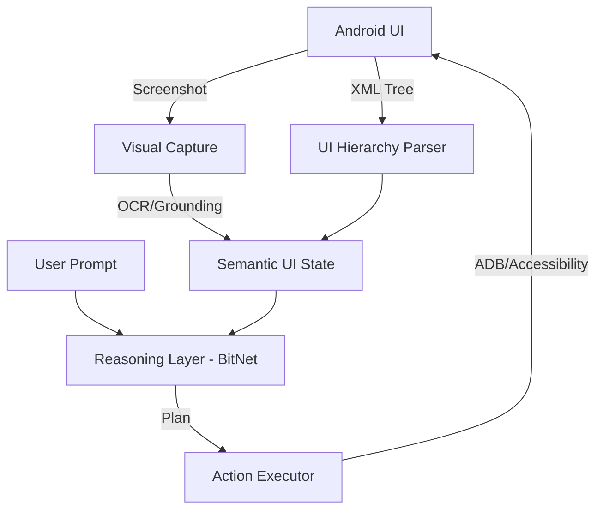

# Modular System Planning

This plan breaks down the development into independent modules to ensure scalability and maintainability.

## Phase 1: Foundation (Current)
- **Repo Analysis**: Deep dive into `bitnet.cpp` and `uiautomator2`.
- **Environment Setup**: Python/C++ toolchains for cross-compilation.
- **Documentation**: Arch-spec and feasibility analysis.

## Phase 2: Perception Module (Vision & Structure)
- **Visual Capture**: Implement `scrcpy`-based high-speed screenshot/stream interface.
- **Structural Discovery**: Integrate `uiautomator2` to extract XML UI hierarchies.
- **Semantic Grounding**: Prototype a "UI-to-Text" converter (HTML/Markdown representation of the UI for the LLM).

## Phase 3: Reasoning Module (LLM)
- **Model Selection**: Evaluate BitNet 1.58b 1B/3B vs Phi-3-mini 4-bit.
- **Optimization**: Compile `bitnet.cpp` for aarch64 (Android).
- **Prompt Engineering**: Develop robust system prompts for UI navigation tasks.

## Phase 4: Control Module (Execution)
- **Atomic Actions**: Standardize commands: `TAP(x,y)`, `INPUT(text)`, `SWIPE(dir)`, `BACK()`.
- **Validation**: Post-action verification (did the screen change as expected?).

## Phase 5: Memory & Persistence
- **Context Management**: Track previous actions and observations in a short-term buffer.
- **Workflow Storage**: Allow users to "save" complex sequences as named macros.

## Phase 6: On-Device Integration
- **Android App**: A native "Controller" app (Service) that hosts the LLM and manages Accessibility/ADB permissions.
- **UI**: Minimal overlay or notification-based control.

## Component Interaction Diagram (Concept)

